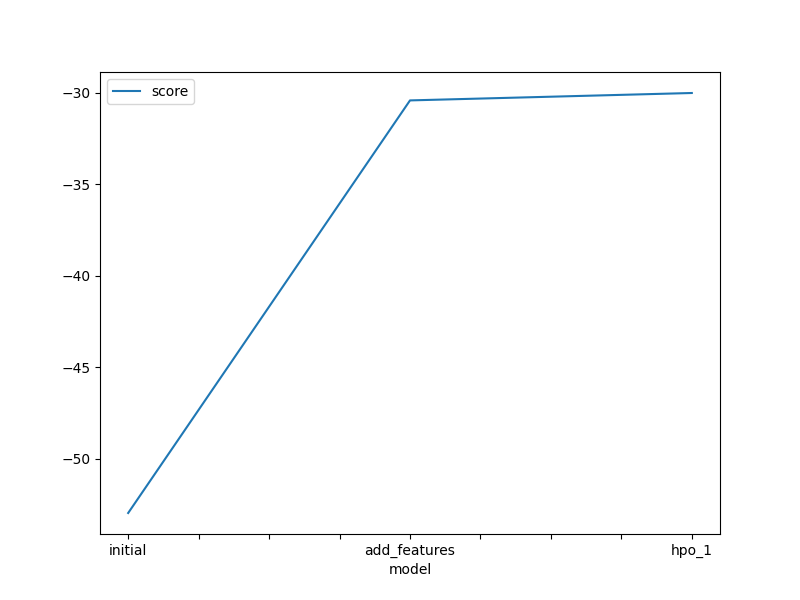
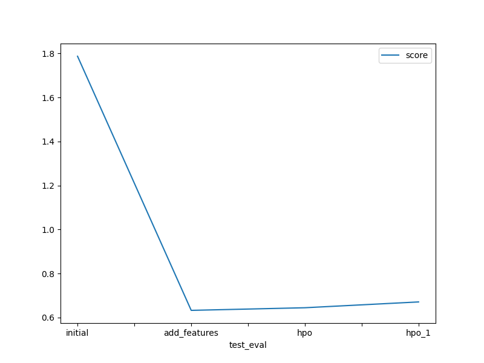

# Report: Predict Bike Sharing Demand with AutoGluon Solution
#### Pham Nguyen Hung

## Initial Training

### What did you realize when you tried to submit your predictions? What changes were needed to the output of the predictor to submit your results?

As explained, Kaggle

### What was the top ranked model that performed?
TODO: Add your explanation

## Exploratory data analysis and feature creation
### What did the exploratory analysis find and how did you add additional features?
TODO: Add your explanation

### How much better did your model preform after adding additional features and why do you think that is?
TODO: Add your explanation

## Hyper parameter tuning
### How much better did your model preform after trying different hyper parameters?
TODO: Add your explanation

### If you were given more time with this dataset, where do you think you would spend more time?
TODO: Add your explanation

### Create a table with the models you ran, the hyperparameters modified, and the kaggle score.
|index|model|time\_limit|eval\_metric|score|
|---|---|---|---|---|
|0|initial|600|root\_mean\_squared\_error|1\.78725|
|1|add\_features|600|root\_mean\_squared\_error|0\.63239|
|2|hpo|600|r2|0\.64431|
|3|hpo\_1|1200|root\_mean\_squared\_error|0\.6707|

### Create a line plot showing the top model score for the three (or more) training runs during the project.

TODO: Replace the image below with your own.

### Create a line plot showing the top kaggle score for the three (or more) prediction submissions during the project.

TODO: Replace the image below with your own.

## Summary
TODO: Add your explanation
