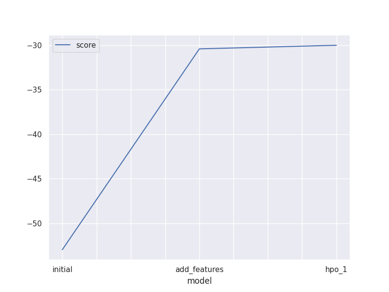
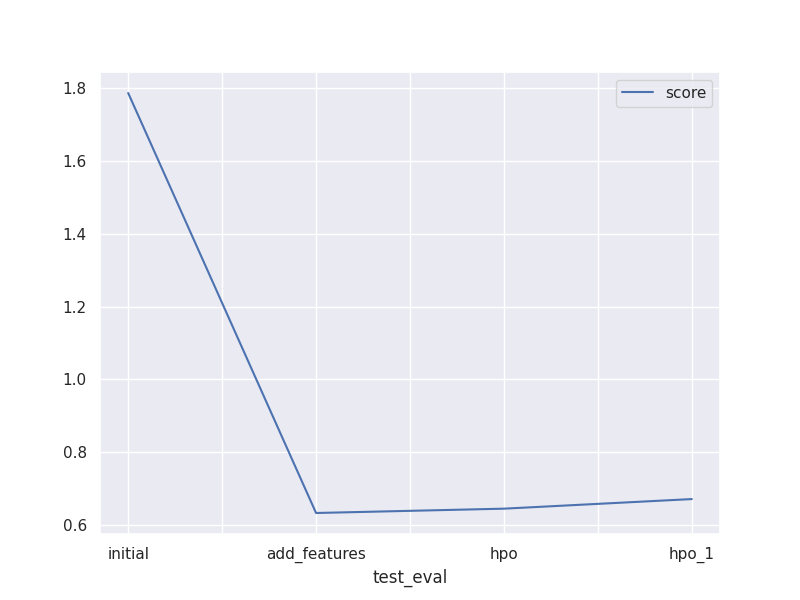
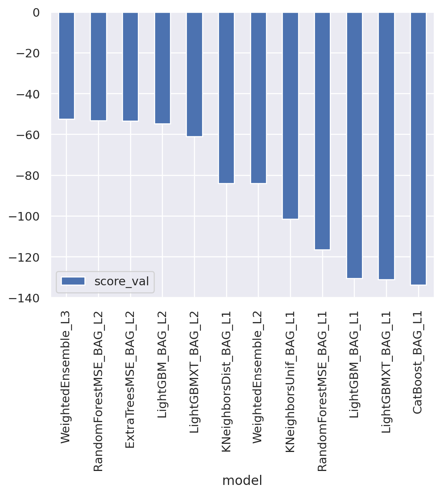
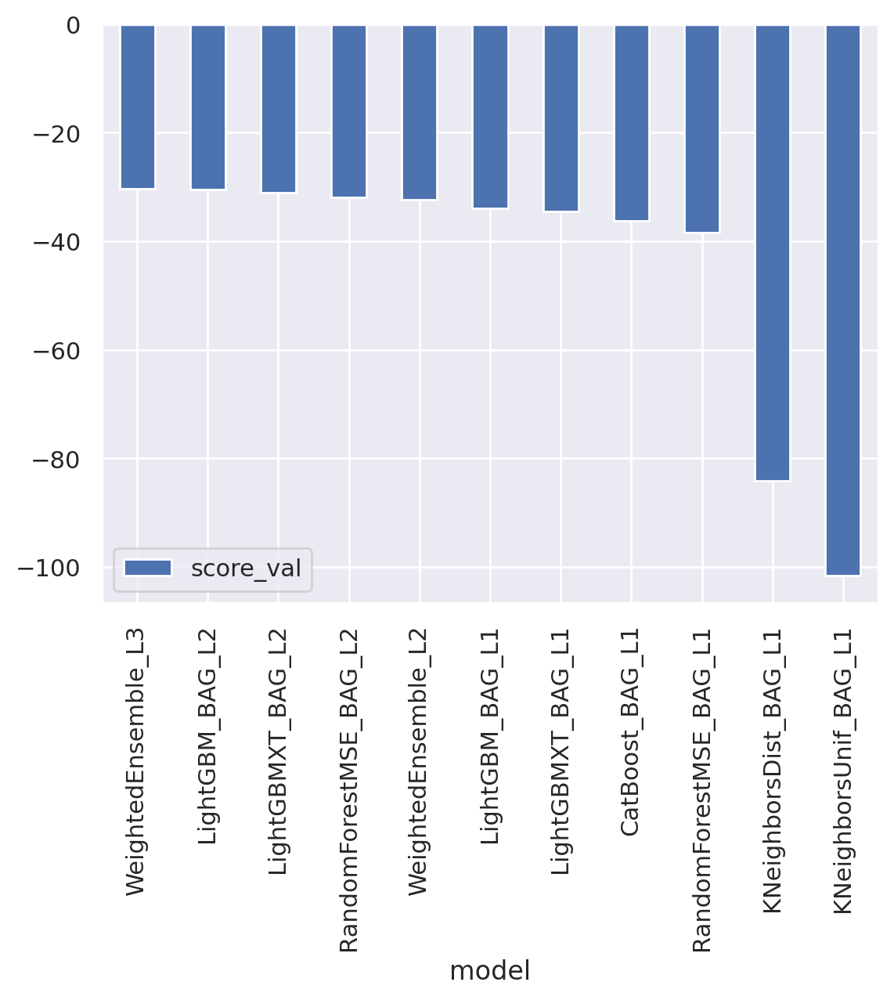
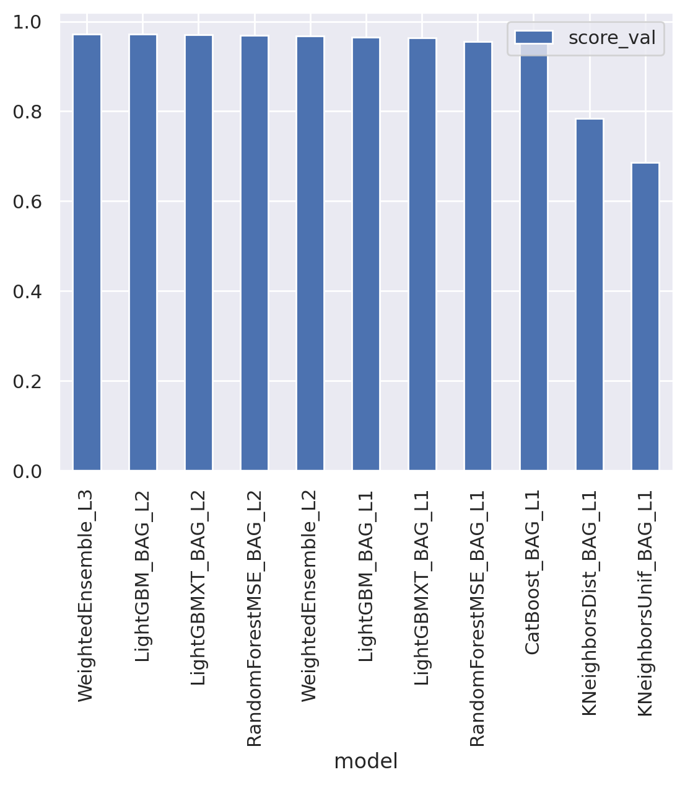
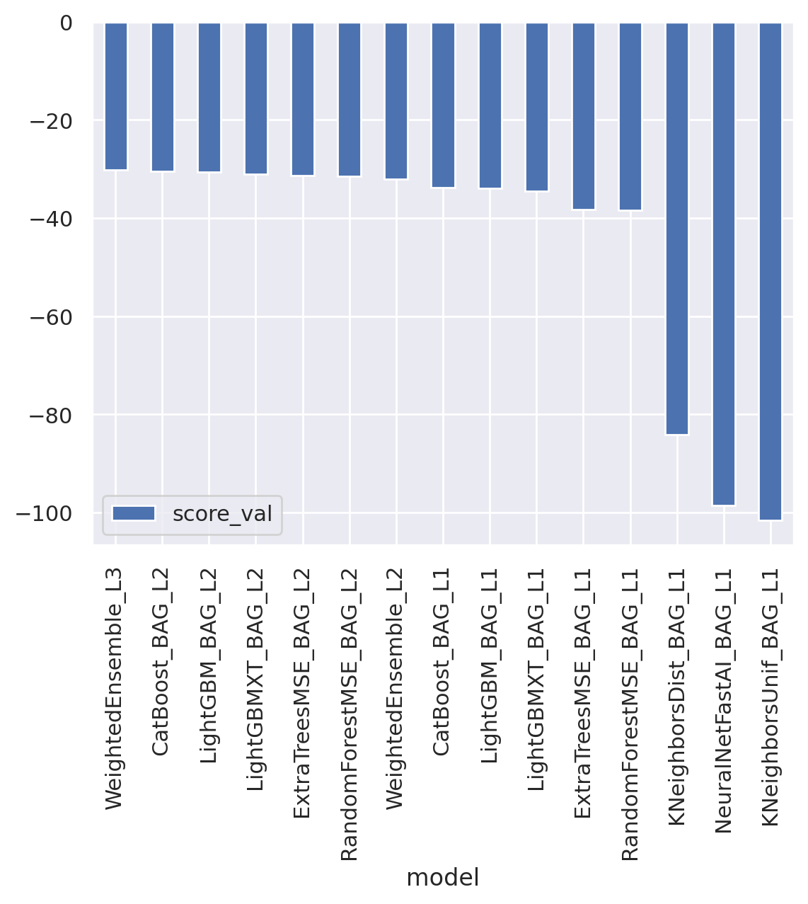

# Report: Predict Bike Sharing Demand with AutoGluon Solution
#### Pham Nguyen Hung

## Initial Training

### What did you realize when you tried to submit your predictions? What changes were needed to the output of the predictor to submit your results?

As explained, Kaggle will reject submissions with negative values. Hence, we will need to clip all negative values to 0. This can be done with Pandas `.lt()` method:

```python
# Checking the number of negative values
predictions.lt(0).sum()

# Set to 0 using boolean indexing
predictions[predictions.lt(0)] = 0
```
There are other ways to achieve the same result, such as using `numpy.clip()` method.

However, checking with `.describe()` method it was observed that the predictions from AutoGluon models were already positive.

### What was the top ranked model that performed?

The third-level ensemble model `WeightedEnsemble_L3` always performed the best.

## Exploratory data analysis and feature creation
### What did the exploratory analysis find and how did you add additional features?
I followed the instruction to separate the hours out of `datetime` column. I hypothesized that the bike sharing demand will depend on the time of the day (e.g., more demand in the morning when people go to work). Hence, I created a new column `hour` and added it to the training and test data.

### How much better did your model preform after adding additional features and why do you think that is?
After adding it, the score (or loss, lower score gives higher place on Competition Leaderboard) improved from `1.78725` to `0.63239`. This means my hypothesis was correct: different time of the day has different demand for bike sharing.

## Hyper-parameter tuning
### How much better did your model preform after trying different hyper parameters?
I tried to change the evaluation metric and the time limit. The time limit allows for more time to train the model, so we should see performance gain from that. However, the loss actually went up, indicating possible overfitting. The evaluation metric was changed to $R^2$ (`r2`), which is used to evaluate the model's explanatory power (i.e., how much of the variance in the data can be explained by the model). The loss increased slightly from `0.63239` to `0.64431`.

### If you were given more time with this dataset, where do you think you would spend more time?

I would spend more time on feature engineering. For example, I would try to create a new feature that groups the `hour` into different time of the day (e.g., morning, afternoon, evening, night).

I also tried creating a Gradient Boosting model from `scikit-learn` with the hyperparameters optimized with `GrideSearchCV` as it seemed to perform well in the Kaggle competition. The loss this time halved again to just `0.38863`. This was surprising since AutoGluon could not detect this model despite experimenting with many ensemble tree models. One possible explanation could be the insufficient maximum depth and number of estimators used in the AutoGluon models (the `scikit-learn` model has a depth of 5 with 200 estimators). I would spend more time on this to see if I can improve the performance of AutoGluon models, potentially with AutoGluon's hyperparameter tuning method.
### Create a table with the models you ran, the hyperparameters modified, and the kaggle score.
|index|model|time\_limit|eval\_metric|score|
|---|---|---|---|---|
|0|initial|600|root\_mean\_squared\_error|1\.78725|
|1|add\_features|600|root\_mean\_squared\_error|0\.63239|
|2|hpo|600|r2|0\.64431|
|3|hpo\_1|1200|root\_mean\_squared\_error|0\.6707|

### Create a line plot showing the top model score for the three (or more) training runs during the project.



### Create a line plot showing the top kaggle score for the three (or more) prediction submissions during the project.



### Additional charts:
Base model leaderboard:


After adding features leaderboard:


After hyperparameter tuning leaderboard:


After hyperparameter tuning with more time limit leaderboard:


All submissions:
|fileName                   | date                | description                            | status   | publicScore | privateScore  
|---------------------------| ------------------- | -------------------------------------- | -------- | ----------- | ------------  
|submission.csv             |  2023-05-27 02:17:27|  gradient boosting with GridSearchCV   |  complete|  0.38863    | 0.38863       
|submission_new_hpo_1.csv   |  2023-05-26 08:41:56|  new features with increased time limit|  complete|  0.67834    | 0.67834       
|submission_new_hpo.csv     |  2023-05-26 08:19:14|  new features with hyperparameters     |  complete|  0.61537    | 0.61537       
|submission_new_features.csv|  2023-05-26 08:06:23|  new features                          |  complete|  0.63415    | 0.63415       
|submission.csv             |  2023-05-26 07:53:31|  first raw submission                  |  complete|  1.81590    | 1.81590       
|submission.csv             |  2023-05-26 06:48:23|  gradient boosting with GridSearchCV   |  complete|  0.38863    | 0.38863       
|submission_new_hpo_1.csv   |  2023-05-26 06:27:38|  new features with increased time limit|  complete|  0.67070    | 0.67070       
|submission_new_hpo.csv     |  2023-05-26 06:02:10|  new features with hyperparameters     |  complete|  0.64431    | 0.64431       
|submission_new_features.csv|  2023-05-26 05:35:50|  new features                          |  complete|  0.63239    | 0.63239       
|submission.csv             |  2023-05-26 05:09:08|  first raw submission                  |  complete|  1.78725    | 1.78725       

## Summary
In the project, I submitted an entry for a Kaggle tabular data competition with AutoGluon. Starting from the default setting, I improved it by adding features and conducted hyperparameter tuning. The Kaggle score improved significantly from `1.78725` to `0.63239`. The score was further reduced to `0.38863` with a Gradient Boosting model with GridSearchCV from `scikit-learn`. The best performing model was the Gradient Boosting model from `scikit-learn` with hyperparameters optimized using `GridSearchCV`, which was surprising given AutoGluon also used ensemble model. Further improvements could potentially be made by more feature engineering and conduct hyperparameter tuning *on the model* instead of just with the training process for AutoGluon.